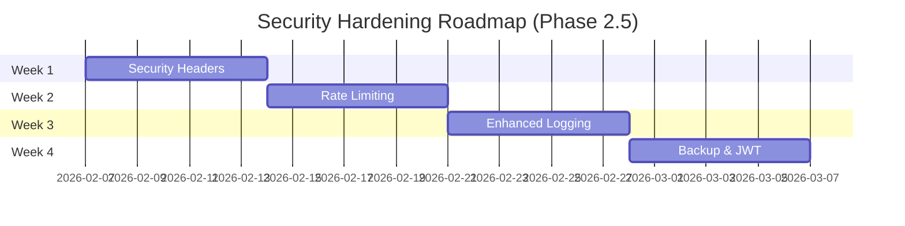

# JERP 3.0 Architecture Documentation

## Table of Contents
1. [System Architecture Overview](#system-architecture-overview)
2. [Technology Stack](#technology-stack)
3. [Data Flow and Integration Patterns](#data-flow-and-integration-patterns)
4. [Security Architecture](#security-architecture)
5. [Deployment Architecture](#deployment-architecture)

---

## System Architecture Overview

### High-Level Architecture Diagram

```
┌─────────────────────────────────────────────────────────────┐
│                     JERP 3.0 Architecture                    │
├─────────────────────────────────────────────────────────────┤
│                                                              │
│  ┌──────────────┐      ┌──────────────┐    ┌─────────────┐│
│  │   Web App    │      │    Admin     │    │   Partner   ││
│  │ (Next.js/TS) │◄────►│    Portal    │    │   Portal    ││
│  └──────────────┘      └──────────────┘    └─────────────┘│
│         │                      │                    │       │
│         └──────────────────────┴────────────────────┘       │
│                              │                              │
│                              ▼                              │
│                   ┌──────────────────────┐                  │
│                   │   API Gateway/BFF    │                  │
│                   │    (ASP.NET Core)    │                  │
│                   └──────────────────────┘                  │
│                              │                              │
│         ┌────────────────────┼────────────────────┐         │
│         ▼                    ▼                    ▼         │
│  ┌────────────┐      ┌────────────┐      ┌────────────┐   │
│  │  Finance   │      │ Inventory  │      │   Sales    │   │
│  │   Module   │      │   Module   │      │   Module   │   │
│  │  + Payroll │      │            │      │            │   │
│  └────────────┘      └────────────┘      └────────────┘   │
│         │                    │                    │         │
│         └────────────────────┴────────────────────┘         │
│                              │                              │
│                              ▼                              │
│                   ┌──────────────────────┐                  │
│                   │   Data Access Layer  │                  │
│                   │  (Entity Framework)  │                  │
│                   └──────────────────────┘                  │
│                              │                              │
│                              ▼                              │
│                   ┌──────────────────────┐                  │
│                   │  SQL Server Database │                  │
│                   └──────────────────────┘                  │
└─────────────────────────────────────────────────────────────┘
```

### Layered Architecture

JERP 3.0 follows a clean architecture pattern with clear separation of concerns:

```
┌─────────────────────────────────────────────────────┐
│                  Presentation Layer                 │
│  ┌────────────┐  ┌────────────┐  ┌────────────┐   │
│  │ JERP.Api   │  │ Next.js    │  │  Desktop   │   │
│  │ (REST API) │  │  Web App   │  │    App     │   │
│  └────────────┘  └────────────┘  └────────────┘   │
└─────────────────────────────────────────────────────┘
                        │
┌─────────────────────────────────────────────────────┐
│                  Application Layer                  │
│          ┌──────────────────────────────┐           │
│          │    JERP.Application          │           │
│          │  • Services                  │           │
│          │  • DTOs                      │           │
│          │  • Validators                │           │
│          │  • Business Logic            │           │
│          └──────────────────────────────┘           │
└─────────────────────────────────────────────────────┘
                        │
┌─────────────────────────────────────────────────────┐
│                    Domain Layer                     │
│          ┌──────────────────────────────┐           │
│          │      JERP.Core               │           │
│          │  • Entities                  │           │
│          │  • Interfaces                │           │
│          │  • Enums                     │           │
│          │  • Domain Logic              │           │
│          └──────────────────────────────┘           │
└─────────────────────────────────────────────────────┘
                        │
┌─────────────────────────────────────────────────────┐
│               Infrastructure Layer                  │
│   ┌────────────────────────────────────────┐        │
│   │    JERP.Infrastructure                 │        │
│   │  • Data (DbContext, Migrations)        │        │
│   │  • Repositories                        │        │
│   │  • External Services                   │        │
│   │  • Configurations                      │        │
│   └────────────────────────────────────────┘        │
└─────────────────────────────────────────────────────┘
                        │
┌─────────────────────────────────────────────────────┐
│              Compliance Layer (Optional)            │
│          ┌──────────────────────────────┐           │
│          │   JERP.Compliance            │           │
│          │  • Cannabis Regulations      │           │
│          │  • 280E Tax Tracking         │           │
│          │  • Metrc/Biotrack APIs       │           │
│          └──────────────────────────────┘           │
└─────────────────────────────────────────────────────┘
```

### Module Architecture

Each business module (Finance, Inventory, Sales) follows a consistent structure:

```
Module (e.g., Finance)
├── Entities/
│   ├── Account.cs
│   ├── JournalEntry.cs
│   ├── GeneralLedgerEntry.cs
│   └── ...
├── DTOs/
│   ├── AccountDto.cs
│   ├── CreateAccountDto.cs
│   └── UpdateAccountDto.cs
├── Services/
│   ├── IAccountService.cs
│   └── AccountService.cs
├── Controllers/
│   └── AccountsController.cs
└── Configurations/
    └── AccountConfiguration.cs
```

---

## Technology Stack

### Frontend Technologies

#### Next.js Web Application
- **Next.js 16.1.6**: Modern React framework with server-side rendering
- **React 18.2**: UI component library
- **TypeScript 5.3**: Type-safe JavaScript
- **Tailwind CSS**: Utility-first CSS framework
- **Recharts 2.15**: Data visualization and charting
- **Framer Motion 11.0**: Animation library
- **Lucide React**: Icon library
- **Next-Auth 4.24**: Authentication for Next.js
- **React Hook Form 7.49**: Form management
- **Zod 3.22**: TypeScript-first schema validation

#### Build Tools
- **Next.js**: Built-in bundling and optimization
- **TypeScript Compiler**: Type checking and transpilation
- **PostCSS**: CSS processing
- **ESLint**: Code linting

### Backend Technologies

#### ASP.NET Core Stack
- **.NET 8.0**: Latest LTS version of .NET
- **ASP.NET Core 8.0**: Web API framework
- **Entity Framework Core 8.0**: Object-Relational Mapper (ORM)
- **C# 12**: Programming language

#### Database
- **Microsoft SQL Server 2022**: Primary relational database
  - SQL Server Express (development)
  - Developer/Standard/Enterprise editions (production)
- **Entity Framework Core Migrations**: Database schema versioning

#### Backend Libraries & Packages
- **Serilog**: Structured logging
- **AutoMapper**: Object-to-object mapping
- **FluentValidation**: Input validation library
- **BCrypt/PBKDF2**: Password hashing
- **JWT Bearer**: Token-based authentication
- **Swashbuckle (Swagger)**: API documentation
- **Prisma**: Alternative ORM for Next.js backend features

### Infrastructure & DevOps

#### Containerization
- **Docker**: Container platform
- **Docker Compose**: Multi-container orchestration

#### Reverse Proxy & Web Server
- **NGINX**: Reverse proxy, load balancing, SSL termination (optional)

#### Planned Infrastructure
- **Redis**: Caching layer (planned)
- **Message Queue**: RabbitMQ or Azure Service Bus (planned)
- **Blob Storage**: File storage (planned)

### Development Tools

#### Version Control
- **Git**: Distributed version control
- **GitHub**: Repository hosting and collaboration

#### IDEs & Editors
- **Visual Studio 2022**: Primary .NET IDE
- **Visual Studio Code**: Lightweight editor for frontend and backend
- **JetBrains Rider**: Alternative .NET IDE

#### Testing Frameworks
- **xUnit**: Unit testing framework for .NET
- **Moq**: Mocking library
- **FluentAssertions**: Assertion library
- **Testcontainers**: Docker containers for integration tests

#### API Tools
- **Swagger UI**: Interactive API documentation
- **Postman/Insomnia**: API testing

### Third-Party Integrations

#### Cannabis Compliance (Planned)
- **Metrc API**: Cannabis track-and-trace system
- **BioTrack API**: Alternative compliance system
- **LeafLink API**: Wholesale marketplace

#### Payment Processing (Planned)
- **Stripe**: Payment gateway
- **PayPal**: Alternative payment option

#### Accounting Integrations (Planned)
- **QuickBooks API**: Accounting sync
- **Xero API**: Alternative accounting platform

---

## Data Flow and Integration Patterns

### 1. Request/Response Flow

#### Standard API Request Flow

```
┌─────────┐      ┌────────────┐      ┌─────────────┐      ┌──────────┐      ┌──────────┐
│ Client  │─────>│   NGINX    │─────>│  API        │─────>│ Business │─────>│ Database │
│ (Web)   │      │  (Proxy)   │      │ Controller  │      │ Service  │      │          │
└─────────┘      └────────────┘      └─────────────┘      └──────────┘      └──────────┘
     │                                      │                     │                │
     │                                      │                     │                │
     │<─────────────────────────────────────┴─────────────────────┴────────────────┘
     │                         Response with data
     └────────────────────────────────────────────────────────────────────────────────>
```

**Detailed Steps:**

1. **Client Request**: Web application sends HTTP request (GET, POST, PUT, DELETE)
2. **Reverse Proxy (Optional)**: NGINX routes request to API server
3. **API Controller**: 
   - Receives request
   - Validates JWT token (authentication)
   - Checks user permissions (authorization)
4. **Service Layer**:
   - Executes business logic
   - Validates input with FluentValidation
   - Performs calculations and data transformations
5. **Data Access Layer**:
   - Repository pattern for data access
   - Entity Framework translates to SQL
   - Queries or updates database
6. **Database**: SQL Server processes query
7. **Response Path**: Data flows back through layers
   - Entity → DTO mapping (AutoMapper)
   - JSON serialization
   - HTTP response with status code

### 2. Authentication Flow

#### JWT Token Authentication

```
┌─────────┐                 ┌──────────────┐                 ┌──────────┐
│ Client  │                 │   API        │                 │ Database │
└─────────┘                 └──────────────┘                 └──────────┘
     │                              │                              │
     │  1. POST /api/auth/login    │                              │
     │  { username, password }      │                              │
     │─────────────────────────────>│                              │
     │                              │  2. Query user & verify      │
     │                              │──────────────────────────────>│
     │                              │<──────────────────────────────│
     │                              │  3. User data                │
     │                              │                              │
     │                              │  4. Generate JWT token       │
     │                              │     (userId, roles, claims)  │
     │                              │                              │
     │  5. Return JWT token         │                              │
     │<─────────────────────────────│                              │
     │  { token, refreshToken }     │                              │
     │                              │                              │
     │  6. Subsequent requests      │                              │
     │  Header: Authorization:      │                              │
     │  Bearer <JWT>                │                              │
     │─────────────────────────────>│                              │
     │                              │  7. Validate JWT signature   │
     │                              │  8. Check expiration         │
     │                              │  9. Extract user claims      │
     │                              │                              │
     │  10. Protected resource      │                              │
     │<─────────────────────────────│                              │
```

**JWT Token Contents:**
```json
{
  "sub": "user-id-123",
  "email": "ichbincesartobar@yahoo.com",
  "roles": ["Admin", "Finance"],
  "companyId": "company-456",
  "exp": 1707148800,
  "iat": 1707145200
}
```

### 3. Module Communication Patterns

#### Finance Module Integration with Payroll

```
┌──────────────┐         ┌──────────────┐         ┌──────────────┐
│   Payroll    │         │   Finance    │         │   General    │
│   Module     │         │   Module     │         │   Ledger     │
└──────────────┘         └──────────────┘         └──────────────┘
       │                        │                         │
       │  1. Process Payroll    │                         │
       │  (Calculate wages,     │                         │
       │   taxes, deductions)   │                         │
       │                        │                         │
       │  2. Create GL Entry    │                         │
       │────────────────────────>│                         │
       │                        │                         │
       │                        │  3. Post to GL          │
       │                        │─────────────────────────>│
       │                        │                         │
       │                        │  4. Create entries:     │
       │                        │     DR: Wages Expense   │
       │                        │     CR: Cash/AP         │
       │                        │     CR: Tax Payable     │
       │                        │                         │
       │  5. Confirmation       │                         │
       │<────────────────────────│                         │
```

#### Inventory and Finance Integration (COGS)

```
Sale Transaction:
  1. Sales Module records sale → Updates inventory quantity
  2. Inventory Module calculates COGS (Cost of Goods Sold)
  3. Finance Module creates journal entry:
     DR: Cost of Goods Sold (Expense)
     CR: Inventory (Asset)
```

### 4. External Integrations

#### Cannabis Compliance API Integration (Planned)

```
┌──────────────┐         ┌──────────────┐         ┌──────────────┐
│  JERP 3.0    │         │  Compliance  │         │    Metrc     │
│   System     │         │   Service    │         │     API      │
└──────────────┘         └──────────────┘         └──────────────┘
       │                        │                         │
       │  1. Inventory Change   │                         │
       │  (Sale, Transfer)      │                         │
       │                        │                         │
       │  2. Trigger Sync       │                         │
       │────────────────────────>│                         │
       │                        │                         │
       │                        │  3. Send tracking data  │
       │                        │─────────────────────────>│
       │                        │  (Package ID, quantity, │
       │                        │   date, license #)      │
       │                        │                         │
       │                        │  4. Acknowledge receipt │
       │                        │<─────────────────────────│
       │                        │                         │
       │  5. Update status      │                         │
       │<────────────────────────│                         │
       │  (Compliant/Error)     │                         │
```

### 5. Data Persistence Patterns

#### Repository Pattern

```csharp
// Generic Repository Interface
public interface IRepository<T> where T : BaseEntity
{
    Task<T> GetByIdAsync(Guid id);
    Task<IEnumerable<T>> GetAllAsync();
    Task<T> AddAsync(T entity);
    Task UpdateAsync(T entity);
    Task DeleteAsync(Guid id);
}

// Entity Framework Implementation
public class Repository<T> : IRepository<T> where T : BaseEntity
{
    private readonly JerpDbContext _context;
    private readonly DbSet<T> _dbSet;

    public Repository(JerpDbContext context)
    {
        _context = context;
        _dbSet = context.Set<T>();
    }

    public async Task<T> GetByIdAsync(Guid id)
    {
        return await _dbSet.FindAsync(id);
    }
    // ... other methods
}
```

#### Unit of Work Pattern

```csharp
public interface IUnitOfWork : IDisposable
{
    IRepository<Account> Accounts { get; }
    IRepository<JournalEntry> JournalEntries { get; }
    IRepository<Product> Products { get; }
    
    Task<int> CommitAsync();
    Task RollbackAsync();
}
```

---

## Security Architecture

### Security Implementation Status

**Current Security Posture: 65% Complete**

#### ✅ Implemented Security Features

**Authentication & Authorization:**
- ✅ JWT token-based authentication
- ✅ Role-Based Access Control (RBAC)
- ✅ Multi-tenant data isolation with query filters
- ✅ Session management with token expiration

**Password & Data Protection:**
- ✅ BCrypt password hashing (work factor 12)
- ✅ HTTPS/TLS encryption in transit
- ✅ CORS configuration
- ✅ SQL injection prevention (EF Core parameterized queries)
- ✅ Input validation with FluentValidation

**Audit & Compliance:**
- ✅ Basic audit logging
- ✅ Multi-tenant data segregation
- ✅ FASB ASC compliance tracking

#### ⏳ Planned Security Enhancements (Phase 2.5 - February 2026)

**Week 1: Security Headers & Response Protection**
- ⏳ Security headers middleware
  - HSTS (HTTP Strict Transport Security)
  - X-Content-Type-Options: nosniff
  - X-Frame-Options: DENY
  - X-XSS-Protection
  - Content-Security-Policy (CSP)
  - Referrer-Policy
- ⏳ Secure cookie configuration with HttpOnly and Secure flags
- ⏳ HTTPS enforcement in production

**Week 2: Rate Limiting & API Protection**
- ⏳ Per-endpoint rate limiting
- ⏳ Per-user API throttling
- ⏳ IP-based rate limiting
- ⏳ Brute force protection (login attempts)
- ⏳ Request size limits
- ⏳ DDoS mitigation strategies

**Week 3: Enhanced Logging & Monitoring**
- ⏳ Serilog structured logging integration
- ⏳ Security event logging (failed logins, authorization failures)
- ⏳ Audit trail enhancements
- ⏳ Log aggregation and centralized monitoring
- ⏳ Real-time alerting for suspicious activities

**Week 4: Backup Automation & JWT Hardening**
- ⏳ Automated daily database backups
- ⏳ Backup verification and recovery testing
- ⏳ JWT token security review and improvements
- ⏳ Refresh token mechanism
- ⏳ Session management enhancements

**Security Testing & Validation**
- ⏳ OWASP Top 10 compliance verification
- ⏳ Penetration testing (external service)
- ⏳ Vulnerability scanning (OWASP ZAP, Dependabot)
- ⏳ Security code review
- ⏳ Mozilla Observatory grade A+ target

#### ⚠️ Known Security Gaps (To be addressed in Phase 2.5)

1. **Missing Security Headers**: No Content-Security-Policy, HSTS, or X-Frame-Options
2. **No Rate Limiting**: API endpoints vulnerable to brute force and DDoS
3. **Limited Logging**: No structured logging for security events
4. **Manual Backups**: No automated backup system in place
5. **JWT Token Security**: Token refresh mechanism needs improvement

#### 🎯 Security Roadmap



---

### Authentication & Authorization

#### JWT Token-Based Authentication

**Token Generation:**
```csharp
var tokenHandler = new JwtSecurityTokenHandler();
var key = Encoding.ASCII.GetBytes(_configuration["Jwt:SecretKey"]);
var tokenDescriptor = new SecurityTokenDescriptor
{
    Subject = new ClaimsIdentity(new[]
    {
        new Claim(ClaimTypes.NameIdentifier, user.Id.ToString()),
        new Claim(ClaimTypes.Email, user.Email),
        new Claim(ClaimTypes.Role, string.Join(",", user.Roles))
    }),
    Expires = DateTime.UtcNow.AddHours(1),
    SigningCredentials = new SigningCredentials(
        new SymmetricSecurityKey(key),
        SecurityAlgorithms.HmacSha256Signature
    )
};
```

**Token Validation:**
- Signature verification using secret key
- Expiration check
- Issuer and audience validation
- Claims extraction for authorization

#### Role-Based Access Control (RBAC)

**Role Hierarchy:**
```
System Administrator
├── Company Administrator
│   ├── Finance Manager
│   │   ├── Accountant
│   │   └── Accounts Payable Clerk
│   ├── Inventory Manager
│   │   └── Warehouse Staff
│   └── Sales Manager
│       └── Sales Representative
└── Auditor (Read-only)
```

**Permission Model:**
```csharp
public enum Permission
{
    // Finance
    ViewFinancialReports,
    CreateJournalEntry,
    PostJournalEntry,
    VoidJournalEntry,
    
    // Inventory
    ViewInventory,
    AdjustInventory,
    CreateProduct,
    
    // Sales
    CreateSalesOrder,
    VoidSalesOrder,
    
    // Admin
    ManageUsers,
    ManageCompanySettings
}
```

**Controller Authorization:**
```csharp
[Authorize(Roles = "Admin,FinanceManager")]
[HttpPost("journal-entries")]
public async Task<IActionResult> CreateJournalEntry([FromBody] CreateJournalEntryDto dto)
{
    // Implementation
}
```

#### Multi-Tenant Data Isolation

**Tenant Identification:**
- Tenant ID stored in JWT token claims
- Automatically applied to all queries via EF Core query filters

```csharp
// Global query filter
modelBuilder.Entity<Account>()
    .HasQueryFilter(a => a.CompanyId == _currentUser.CompanyId);
```

**Data Segregation:**
- Each company has a unique `CompanyId` (GUID)
- All entities include `CompanyId` foreign key
- Queries automatically filtered by tenant
- Prevents cross-tenant data access

### Password Security

**Hashing Algorithm:**
- BCrypt with work factor 12
- Salt automatically generated per password
- Rainbow table attacks prevented

```csharp
public class PasswordHasher
{
    public string HashPassword(string password)
    {
        return BCrypt.Net.BCrypt.HashPassword(password, workFactor: 12);
    }

    public bool VerifyPassword(string password, string hash)
    {
        return BCrypt.Net.BCrypt.Verify(password, hash);
    }
}
```

**Password Policy:**
- Minimum 8 characters
- Must contain uppercase, lowercase, number, special character
- Password history (last 5 passwords)
- 90-day expiration (configurable)
- Account lockout after 5 failed attempts

### Data Security

#### Encryption in Transit
- **HTTPS/TLS 1.2+**: All API communications
- **Certificate Management**: Let's Encrypt or commercial SSL certificates
- **HSTS**: HTTP Strict Transport Security enabled

```csharp
// HTTPS Redirection
app.UseHttpsRedirection();
app.UseHsts();
```

#### Encryption at Rest
- **Database Encryption**: Transparent Data Encryption (TDE) on SQL Server
- **Backup Encryption**: Encrypted database backups
- **Sensitive Fields**: Additional column-level encryption for SSN, credit cards

#### Sensitive Data Handling
- **Masking in Logs**: PII and financial data masked
```csharp
Log.Information("User {UserId} updated account {AccountMask}", 
    userId, 
    MaskAccountNumber(accountNumber));
```
- **Audit Trail**: All sensitive operations logged
- **Data Retention**: Configurable retention policies

### CORS Policy

```csharp
services.AddCors(options =>
{
    options.AddPolicy("AllowedOrigins", builder =>
    {
        builder
            .WithOrigins(
                "https://app.jerp.io",
                "https://admin.jerp.io",
                "http://localhost:3000"
            )
            .AllowAnyMethod()
            .AllowAnyHeader()
            .AllowCredentials();
    });
});
```

### Compliance & Regulations

#### Cannabis Industry Compliance

**280E Tax Compliance:**
- Separate COGS tracking (deductible)
- Non-deductible expense identification
- FASB ASC topic mapping for audit trail

**Metrc/BioTrack Integration:**
- Secure API key storage in environment variables
- Webhook verification
- Audit logging of all compliance sync operations

#### Accounting Standards
- **FASB ASC**: Financial Accounting Standards Board Codification
- **GAAP**: Generally Accepted Accounting Principles
- **Double-Entry Bookkeeping**: Enforced at application level

#### Data Privacy
- **GDPR Considerations**: For EU customers (planned)
- **CCPA Compliance**: For California customers (planned)
- **Data Deletion**: Right to be forgotten implementation

### Security Best Practices

**Currently Implemented:**
1. ✅ **Principle of Least Privilege**: Users granted minimum required permissions
2. ✅ **Input Validation**: All user input validated with FluentValidation
3. ✅ **SQL Injection Prevention**: Parameterized queries via Entity Framework
4. ✅ **XSS Prevention**: Output encoding in frontend (React escaping)
5. ✅ **Secret Management**: Environment variables, no secrets in code
6. ✅ **Authentication**: JWT-based with role-based authorization

**Planned Implementation (Phase 2.5):**
7. ⏳ **Security Headers**: HSTS, X-Content-Type-Options, X-Frame-Options, CSP
8. ⏳ **CSRF Protection**: Anti-forgery tokens for state-changing operations
9. ⏳ **Rate Limiting**: API throttling and brute force protection
10. ⏳ **Dependency Scanning**: Automated vulnerability scanning with Dependabot
11. ⏳ **Structured Logging**: Serilog for security event monitoring
12. ⏳ **Automated Backups**: Daily database backups with verification

**Security Testing Requirements:**
- ⏳ OWASP ZAP automated scanning
- ⏳ Manual penetration testing
- ⏳ Security code review
- ⏳ Dependency vulnerability scanning
- ⏳ SSL/TLS configuration testing

---

## Deployment Architecture

### Development Environment

#### Local Development Setup

```
Developer Workstation
├── Docker Desktop
│   ├── SQL Server Container (Port 1433)
│   └── API Container (Port 5000)
├── Node.js (Frontend Dev Server - Port 3000)
└── IDE (Visual Studio / VS Code)
```

**Configuration:**
- `.env.example` provides template
- Local SQL Server Express or Docker container
- Hot reload enabled for both frontend and backend
- Swagger UI for API testing

**Development Database:**
- Seed data included
- Sample accounts, users, transactions
- Reset script available

### Staging Environment

#### Staging Deployment Topology

```
┌─────────────────────────────────────────────────────────┐
│                    Staging Server                       │
├─────────────────────────────────────────────────────────┤
│                                                         │
│  ┌─────────────┐         ┌─────────────┐              │
│  │   NGINX     │────────>│  API Server │              │
│  │   (SSL)     │         │  (Docker)   │              │
│  └─────────────┘         └─────────────┘              │
│         │                       │                       │
│         │                       │                       │
│         │                       ▼                       │
│         │              ┌─────────────────┐             │
│         │              │  SQL Server     │             │
│         │              │  (Docker)       │             │
│         │              └─────────────────┘             │
│         │                                               │
│         ▼                                               │
│  ┌─────────────┐                                       │
│  │   Next.js   │                                       │
│  │   (Static)  │                                       │
│  └─────────────┘                                       │
│                                                         │
└─────────────────────────────────────────────────────────┘
```

**Purpose:**
- Pre-production testing
- User acceptance testing (UAT)
- Integration testing with external APIs
- Performance testing

### Production Deployment

#### Production Architecture (Containerized)

```
┌──────────────────────────────────────────────────────────────┐
│                     Production Environment                    │
├──────────────────────────────────────────────────────────────┤
│                                                              │
│  ┌─────────────────────────────────────────────────────┐    │
│  │              Load Balancer / NGINX                  │    │
│  │              (SSL Termination)                      │    │
│  └─────────────────────────────────────────────────────┘    │
│                        │                                     │
│         ┌──────────────┼──────────────┐                      │
│         ▼              ▼              ▼                      │
│  ┌──────────┐   ┌──────────┐   ┌──────────┐                │
│  │ API Pod  │   │ API Pod  │   │ API Pod  │                │
│  │ (Docker) │   │ (Docker) │   │ (Docker) │                │
│  └──────────┘   └──────────┘   └──────────┘                │
│         │              │              │                      │
│         └──────────────┴──────────────┘                      │
│                        │                                     │
│                        ▼                                     │
│         ┌─────────────────────────────┐                      │
│         │    SQL Server (Primary)     │                      │
│         │    (High Availability)      │                      │
│         └─────────────────────────────┘                      │
│                        │                                     │
│                        ▼                                     │
│         ┌─────────────────────────────┐                      │
│         │  SQL Server (Read Replica)  │                      │
│         │      (For Reporting)        │                      │
│         └─────────────────────────────┘                      │
│                                                              │
│  ┌─────────────────────────────────────────────────────┐    │
│  │              Redis Cache (Planned)                  │    │
│  └─────────────────────────────────────────────────────┘    │
│                                                              │
└──────────────────────────────────────────────────────────────┘
```

#### Docker Compose Configuration

**docker-compose.yml:**
```yaml
version: '3.8'

services:
  sqlserver:
    image: mcr.microsoft.com/mssql/server:2022-latest
    environment:
      ACCEPT_EULA: "Y"
      SA_PASSWORD: ${SQLSERVER_PASSWORD}
      MSSQL_PID: Express
    ports:
      - "1433:1433"
    volumes:
      - sqlserver_data:/var/opt/mssql
    healthcheck:
      test: /opt/mssql-tools/bin/sqlcmd -S localhost -U sa -P "$$SA_PASSWORD" -Q "SELECT 1"
      interval: 10s
      timeout: 5s
      retries: 5

  api:
    build:
      context: .
      dockerfile: src/JERP.Api/Dockerfile
    environment:
      ASPNETCORE_ENVIRONMENT: Production
      ConnectionStrings__DefaultConnection: "Server=sqlserver,1433;Database=JERP3_DB;..."
      Jwt__SecretKey: ${JWT_SECRET_KEY}
    ports:
      - "5000:80"
    depends_on:
      sqlserver:
        condition: service_healthy
    restart: unless-stopped

  nginx:
    image: nginx:alpine
    ports:
      - "80:80"
      - "443:443"
    volumes:
      - ./nginx/nginx.conf:/etc/nginx/nginx.conf:ro
      - ./nginx/ssl:/etc/nginx/ssl:ro
    depends_on:
      - api
```

#### Environment Configuration

**Environment Variables:**
```bash
# Database
SQLSERVER_PASSWORD=YourStrong!Passw0rd
ConnectionStrings__DefaultConnection=Server=...

# JWT Authentication
JWT_SECRET_KEY=YourSuperSecretKeyForJWTTokenGenerationMinimum32Characters!
JWT_ISSUER=JERP-API
JWT_AUDIENCE=JERP-Client
JWT_EXPIRATION_HOURS=1

# CORS
CORS_ORIGINS=https://app.jerp.io,https://admin.jerp.io

# Logging
SERILOG_MINIMUM_LEVEL=Information

# Compliance APIs (Planned)
METRC_API_KEY=your-metrc-api-key
METRC_LICENSE_NUMBER=your-license-number
```

#### Health Checks and Monitoring

**Health Check Endpoint:**
```csharp
app.MapHealthChecks("/health", new HealthCheckOptions
{
    ResponseWriter = async (context, report) =>
    {
        var result = JsonSerializer.Serialize(new
        {
            status = report.Status.ToString(),
            checks = report.Entries.Select(e => new
            {
                name = e.Key,
                status = e.Value.Status.ToString(),
                duration = e.Value.Duration.TotalMilliseconds
            })
        });
        context.Response.ContentType = "application/json";
        await context.Response.WriteAsync(result);
    }
});
```

**Monitored Services:**
- API availability
- Database connectivity
- Disk space
- Memory usage
- Response time

**Logging:**
- **Serilog**: Structured logging
- **Log Sinks**: File, Console, (planned: Application Insights, ELK Stack)
- **Log Levels**: Debug, Information, Warning, Error, Critical

#### Backup Strategy

**Database Backups:**
- **Full Backup**: Daily at 2:00 AM
- **Differential Backup**: Every 6 hours
- **Transaction Log Backup**: Every 15 minutes
- **Retention**: 30 days online, 1 year archived

**Backup Script (SQL Server):**
```sql
BACKUP DATABASE [JERP3_DB]
TO DISK = '/backups/JERP3_DB_Full_' + CONVERT(VARCHAR, GETDATE(), 112) + '.bak'
WITH COMPRESSION, CHECKSUM, STATS = 10;
```

**Recovery Testing:**
- Monthly restore testing
- Point-in-time recovery capability
- Documented recovery procedures

#### Scaling Strategy

**Horizontal Scaling:**
- Multiple API instances behind load balancer
- Stateless API design
- Session state in database or distributed cache

**Vertical Scaling:**
- Increase container resources (CPU, memory)
- Database server hardware upgrades

**Database Scaling:**
- Read replicas for reporting queries
- Table partitioning for large datasets
- Index optimization

### CI/CD Pipeline (Planned)

#### Build Pipeline

```
┌──────────────┐      ┌──────────────┐      ┌──────────────┐
│ Git Push     │─────>│ Build & Test │─────>│  Publish     │
│ to develop   │      │   (GitHub    │      │  Artifacts   │
│              │      │   Actions)   │      │              │
└──────────────┘      └──────────────┘      └──────────────┘
```

**Pipeline Steps:**
1. Trigger on push to `develop` or `main`
2. Restore NuGet packages
3. Build solution
4. Run unit tests
5. Run integration tests
6. Code coverage analysis
7. Build Docker images
8. Push images to registry
9. Deploy to environment (staging/production)

**GitHub Actions Workflow:**
```yaml
name: CI/CD Pipeline

on:
  push:
    branches: [main, develop]
  pull_request:
    branches: [main, develop]

jobs:
  build:
    runs-on: ubuntu-latest
    steps:
      - uses: actions/checkout@v3
      - name: Setup .NET
        uses: actions/setup-dotnet@v3
        with:
          dotnet-version: 8.0.x
      - name: Restore dependencies
        run: dotnet restore
      - name: Build
        run: dotnet build --no-restore
      - name: Test
        run: dotnet test --no-build --verbosity normal
```

### Disaster Recovery

**Recovery Time Objective (RTO):** 4 hours  
**Recovery Point Objective (RPO):** 15 minutes

**DR Procedures:**
1. Restore database from latest backup
2. Deploy API containers from last known good image
3. Update DNS to point to DR environment
4. Verify system functionality
5. Notify users of service restoration

---

## Additional Architectural Considerations

### Performance Optimization

**Caching Strategy:**
- **In-Memory Caching**: Frequently accessed reference data
- **Distributed Cache (Redis)**: Session data, API responses (planned)
- **Database Query Caching**: EF Core query cache

**Database Optimization:**
- Proper indexing on foreign keys and query columns
- Avoid N+1 queries with `.Include()` and `.ThenInclude()`
- Use stored procedures for complex queries
- Query execution plan analysis

**API Performance:**
- Pagination for large datasets
- Async/await for I/O operations
- Compression for API responses
- CDN for static assets (planned)

### Scalability Patterns

**Microservices (Future Consideration):**
- Break modules into independent services
- API Gateway pattern
- Service-to-service communication (gRPC, REST)
- Event-driven architecture with message bus

**Database Sharding (Future):**
- Shard by `CompanyId` for multi-tenant scaling
- Separate databases per large tenant

### Observability

**Application Performance Monitoring (Planned):**
- Application Insights or Datadog
- Real-time performance metrics
- Distributed tracing
- Error tracking and alerting

**Business Intelligence (Planned):**
- Power BI integration
- Real-time dashboards
- Custom report builder

---

## Conclusion

JERP 3.0 is built on a solid, modern architecture that balances simplicity with scalability. The clean separation of concerns, use of industry-standard technologies, and focus on security and compliance make it suitable for cannabis businesses and general enterprises alike. The architecture supports future growth through horizontal scaling, modular design, and integration capabilities.

For more information, see:
- [SCOPE-OF-WORK.md](SCOPE-OF-WORK.md) - Detailed feature breakdown
- [ONBOARDING.md](ONBOARDING.md) - Developer setup guide
- [API-DOCUMENTATION.md](API-DOCUMENTATION.md) - API reference
