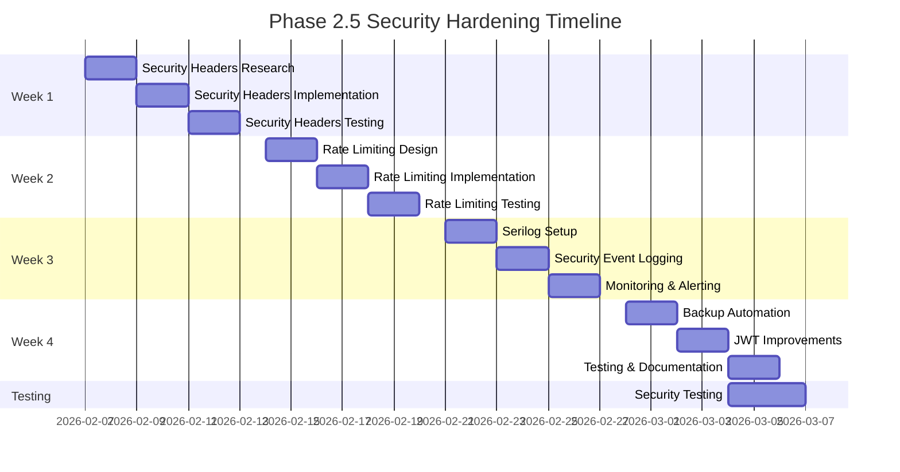

# Security Hardening Roadmap - Phase 2.5

**Project:** JERP 3.0  
**Phase:** 2.5 - Security Hardening  
**Duration:** 3-4 weeks  
**Start Date:** February 7, 2026  
**Target Completion:** March 7, 2026  
**Status:** ⏳ Planned  
**Priority:** 🔴 Critical (Prerequisite for Phase 3)

---

## Executive Summary

Phase 2.5 focuses on addressing security gaps identified during Phase 2 development and establishing enterprise-grade security standards before proceeding to Phase 3 (Inventory Management). This phase is non-negotiable and must be completed before any new feature development.

**Current Security Posture:** 65% Complete  
**Target Security Posture:** 95% Complete  
**Remaining Gap:** Security headers, rate limiting, enhanced logging, automated backups

---

## Objectives

### Primary Goals

1. **Implement Security Headers** - Protect against common web vulnerabilities
2. **Deploy Rate Limiting** - Prevent brute force and DDoS attacks
3. **Integrate Structured Logging** - Enable security monitoring and incident response
4. **Establish Backup Automation** - Ensure business continuity and disaster recovery
5. **Harden JWT Security** - Improve token lifecycle management
6. **Achieve OWASP Top 10 Compliance** - Verify protection against major threats

### Success Metrics

- ✅ All security headers implemented and tested
- ✅ Rate limiting active on 100% of API endpoints
- ✅ Serilog logging configured with security events
- ✅ Automated daily backups running with weekly verification
- ✅ JWT refresh token mechanism functional
- ✅ Zero critical or high-severity vulnerabilities
- ✅ OWASP Top 10 compliance verified
- ✅ Mozilla Observatory grade A or higher
- ✅ Penetration testing completed with issues resolved

---

## Detailed Roadmap

### Week 1: Security Headers & Response Protection (Feb 7-13, 2026)

**Objective:** Implement comprehensive HTTP security headers to protect against common attacks.

#### Day 1-2: Research & Planning
- [x] Review current header configuration
- [ ] Research ASP.NET Core security header middleware options
- [ ] Define Content Security Policy (CSP) rules
- [ ] Document header requirements and configurations

#### Day 3-4: Implementation
- [ ] Implement security headers middleware
  ```csharp
  // Security headers to implement:
  - Strict-Transport-Security: max-age=31536000; includeSubDomains
  - X-Content-Type-Options: nosniff
  - X-Frame-Options: DENY
  - X-XSS-Protection: 1; mode=block
  - Content-Security-Policy: default-src 'self'; ...
  - Referrer-Policy: strict-origin-when-cross-origin
  - Permissions-Policy: geolocation=(), microphone=()
  ```
- [ ] Configure secure cookie settings
  - HttpOnly flag on authentication cookies
  - Secure flag (HTTPS only)
  - SameSite=Strict for CSRF protection
- [ ] Implement HTTPS enforcement in production
- [ ] Add middleware to Startup.cs/Program.cs

#### Day 5: Testing & Validation
- [ ] Test headers using browser dev tools
- [ ] Verify with securityheaders.com
- [ ] Test with Mozilla Observatory
- [ ] Document configuration in ARCHITECTURE.md

**Deliverables:**
- ✅ Security headers middleware implemented
- ✅ Secure cookie configuration
- ✅ HTTPS enforcement
- ✅ Documentation updated
- ✅ Tests passing

**Target:** Mozilla Observatory Grade A

---

### Week 2: Rate Limiting & API Protection (Feb 14-20, 2026)

**Objective:** Implement rate limiting to prevent abuse and DDoS attacks.

#### Day 1-2: Design & Architecture
- [ ] Research rate limiting libraries (AspNetCoreRateLimit)
- [ ] Design rate limiting policies
  - Per-endpoint limits
  - Per-user limits
  - Per-IP limits
- [ ] Define whitelist for internal services
- [ ] Plan Redis integration for distributed rate limiting

#### Day 3-4: Implementation
- [ ] Install AspNetCoreRateLimit package
- [ ] Configure rate limiting policies
  ```csharp
  // Policies to implement:
  - Authentication: 5 req/15 min per IP
  - General API: 100 req/1 min per user
  - Reporting: 20 req/1 min per user
  - File Upload: 10 req/1 min per user
  ```
- [ ] Implement brute force protection on login
- [ ] Add request size limits
- [ ] Configure DDoS mitigation
- [ ] Add rate limit response headers
  - X-RateLimit-Limit
  - X-RateLimit-Remaining
  - X-RateLimit-Reset

#### Day 5: Testing & Monitoring
- [ ] Load test rate limiting policies
- [ ] Verify brute force protection
- [ ] Test rate limit headers
- [ ] Document rate limit policies in API-DOCUMENTATION.md
- [ ] Create monitoring dashboard for rate limit hits

**Deliverables:**
- ✅ Rate limiting middleware configured
- ✅ Brute force protection active
- ✅ API throttling policies defined
- ✅ Documentation updated
- ✅ Monitoring in place

**Target:** Successfully block brute force attempts, handle 1000+ req/sec

---

### Week 3: Enhanced Logging & Monitoring (Feb 21-27, 2026)

**Objective:** Implement structured logging with Serilog for security event monitoring.

#### Day 1-2: Serilog Setup
- [ ] Install Serilog packages
  - Serilog.AspNetCore
  - Serilog.Sinks.File
  - Serilog.Sinks.Console
  - Serilog.Sinks.Seq (optional centralized logging)
- [ ] Configure Serilog in Program.cs
- [ ] Set up log levels and enrichers
- [ ] Configure structured logging format (JSON)

#### Day 3-4: Security Event Logging
- [ ] Implement security event logging
  ```csharp
  Events to log:
  - Failed login attempts (with IP, user agent)
  - Successful logins
  - Authorization failures (403 responses)
  - Rate limit exceeded events
  - JWT token validation failures
  - Data access violations
  - Administrative actions
  - Configuration changes
  - Security header violations
  ```
- [ ] Add correlation IDs for request tracking
- [ ] Implement log filtering (exclude sensitive data)
- [ ] Set up log rotation and retention

#### Day 5: Monitoring & Alerting
- [ ] Set up log aggregation (Seq, ELK, or Splunk)
- [ ] Create security dashboards
- [ ] Configure real-time alerts
  - Multiple failed logins
  - Unusual access patterns
  - Privilege escalation attempts
  - Data export anomalies
- [ ] Document logging configuration

**Deliverables:**
- ✅ Serilog configured and running
- ✅ Security events logged
- ✅ Log aggregation active
- ✅ Alerting configured
- ✅ Dashboards created

**Target:** 100% security event coverage, <1 second log query time

---

### Week 4: Backup Automation & JWT Hardening (Feb 28 - Mar 6, 2026)

**Objective:** Establish automated backups and improve JWT token security.

#### Day 1-2: Backup Automation
- [ ] Design backup strategy
  - Full daily backups at 2 AM
  - Incremental backups every 6 hours
  - 30-day retention policy
- [ ] Implement backup scripts (PowerShell/Bash)
- [ ] Configure SQL Server backup jobs
- [ ] Set up encrypted backup storage
  - Azure Blob Storage with encryption
  - Or AWS S3 with server-side encryption
- [ ] Implement backup verification
- [ ] Schedule automated restore testing (weekly)

#### Day 3-4: JWT Token Improvements
- [ ] Implement refresh token mechanism
  ```csharp
  Features to add:
  - Refresh tokens with 7-day expiration
  - Token refresh endpoint
  - Automatic token refresh before expiration
  - Token revocation on logout
  - Token blacklist for revoked tokens
  ```
- [ ] Add token revocation list (Redis)
- [ ] Implement sliding expiration
- [ ] Add device/session management
- [ ] Improve token claims structure

#### Day 5: Testing & Documentation
- [ ] Test backup and restore procedures
- [ ] Verify backup encryption
- [ ] Test token refresh flow
- [ ] Test token revocation
- [ ] Document backup procedures
- [ ] Update API documentation with refresh token flow

**Deliverables:**
- ✅ Automated daily backups
- ✅ Backup verification process
- ✅ JWT refresh token system
- ✅ Token revocation mechanism
- ✅ Documentation complete

**Target:** RPO < 6 hours, RTO < 4 hours, 100% successful backup verification

---

## Security Testing & Validation

### Week 4 (Parallel Activities)

#### Vulnerability Scanning
- [ ] Run OWASP ZAP automated scan
- [ ] Execute Dependabot vulnerability scan
- [ ] Scan Docker images for vulnerabilities
- [ ] Review and update dependencies

#### Manual Security Testing
- [ ] Test OWASP Top 10 vulnerabilities manually
  1. [ ] Broken Access Control
  2. [ ] Cryptographic Failures
  3. [ ] Injection
  4. [ ] Insecure Design
  5. [ ] Security Misconfiguration
  6. [ ] Vulnerable and Outdated Components
  7. [ ] Identification and Authentication Failures
  8. [ ] Software and Data Integrity Failures
  9. [ ] Security Logging and Monitoring Failures
  10. [ ] Server-Side Request Forgery

#### Penetration Testing
- [ ] Engage external security firm (optional)
- [ ] Conduct internal penetration testing
- [ ] Test authentication bypass attempts
- [ ] Test authorization violations
- [ ] Test SQL injection vectors
- [ ] Test XSS vulnerabilities
- [ ] Test CSRF protection

#### Compliance Verification
- [ ] Verify Mozilla Observatory grade A+
- [ ] Test with securityheaders.com
- [ ] SSL Labs SSL Test (A+ grade)
- [ ] Verify GDPR compliance features
- [ ] Check SOX compliance requirements

---

## Risk Management

### Identified Risks

| Risk | Impact | Probability | Mitigation |
|------|--------|-------------|------------|
| Breaking changes from security updates | High | Medium | Thorough testing, staged rollout |
| Performance impact from rate limiting | Medium | High | Performance testing, optimization |
| Log storage costs | Low | High | Implement retention policies, compression |
| Backup storage costs | Medium | Medium | Efficient compression, lifecycle policies |
| Token refresh complexity | Medium | Low | Clear documentation, thorough testing |

### Contingency Plans

**If Rate Limiting Causes Issues:**
- Adjust limits based on usage patterns
- Implement tiered rate limits by subscription
- Add caching to reduce API calls

**If Backup Size Too Large:**
- Implement incremental backups
- Use compression
- Archive old data to cold storage

**If Performance Degradation:**
- Optimize middleware order
- Use Redis for rate limiting state
- Profile and optimize slow operations

---

## Success Criteria

### Technical Metrics

- ✅ **Security Headers:** All headers implemented, Mozilla Observatory Grade A+
- ✅ **Rate Limiting:** Successfully blocks >5 login attempts in 15 minutes
- ✅ **Logging:** 100% of security events logged with <100ms overhead
- ✅ **Backups:** Daily backups completing in <30 minutes, 100% verification success
- ✅ **JWT Security:** Token refresh working, revocation functional
- ✅ **Vulnerabilities:** Zero critical, zero high-severity findings

### Testing Metrics

- ✅ **OWASP Top 10:** All 10 categories verified compliant
- ✅ **Penetration Testing:** No critical findings
- ✅ **Automated Scans:** Clean results from OWASP ZAP
- ✅ **SSL/TLS:** SSL Labs Grade A+
- ✅ **Dependencies:** No known vulnerabilities in packages

### Operational Metrics

- ✅ **Uptime:** No downtime during implementation
- ✅ **Performance:** <5% degradation in API response times
- ✅ **Monitoring:** Security dashboards operational
- ✅ **Documentation:** All updates completed
- ✅ **Training:** Team trained on new security features

---

## Resource Requirements

### Human Resources

**Primary Developer:** 1 full-time (40 hours/week)
- Backend security implementation
- Testing and validation
- Documentation

**Part-Time Resources:**
- Security consultant (8 hours) - penetration testing
- DevOps engineer (4 hours) - backup automation
- QA tester (8 hours) - security testing

### Infrastructure

**Development:**
- Development environment
- Testing environment
- Security scanning tools

**Production:**
- Backup storage (Azure Blob or AWS S3)
- Redis instance (for rate limiting and token revocation)
- Log aggregation service (Seq or ELK)

### Budget Estimate

| Item | Cost | Frequency |
|------|------|-----------|
| Penetration testing (external) | $2,000 | One-time |
| Security scanning tools | $500 | Annual |
| Backup storage (500GB) | $50 | Monthly |
| Redis instance | $100 | Monthly |
| Log aggregation service | $200 | Monthly |
| **Total Initial** | **$2,500** | - |
| **Total Monthly** | **$350** | Ongoing |

---

## Documentation Updates

### Files to Update

- [x] **SECURITY.md** - Security policy and features
- [x] **ARCHITECTURE.md** - Security architecture section
- [x] **README.md** - Security status
- [x] **API-DOCUMENTATION.md** - Authentication and security
- [x] **ONBOARDING.md** - Security development guidelines
- [x] **SCOPE-OF-WORK.md** - Phase 2.5 details
- [ ] **CHANGELOG.md** - Security updates log

### New Documentation

- [x] **docs/SECURITY-ROADMAP.md** - This document
- [ ] Security runbook for incident response
- [ ] Backup and restore procedures
- [ ] Security monitoring playbook

---

## Post-Implementation

### Phase 2.5 Completion Checklist

- [ ] All security features implemented and tested
- [ ] Zero critical vulnerabilities
- [ ] Security documentation complete
- [ ] Team trained on security features
- [ ] Monitoring and alerting active
- [ ] Backup procedures verified
- [ ] Performance benchmarks met
- [ ] Sign-off from project stakeholders

### Handoff to Phase 3

**Before Starting Phase 3 (Inventory Management):**

1. ✅ Phase 2.5 completed 100%
2. ✅ Security testing passed
3. ✅ Documentation updated
4. ✅ Production deployment successful
5. ✅ Monitoring validated
6. ✅ No outstanding security issues

**Phase 3 Security Requirements:**

- Apply security best practices to all new features
- Security review for every new API endpoint
- Continued vulnerability scanning
- Regular security audits
- Maintain security testing in CI/CD

---

## Timeline Overview



---

## Contact & Escalation

### Project Lead
**Julio Cesar Mendez Tobar**  
Email: ichbincesartobar@yahoo.com  
Role: Full-stack developer, security implementation

### Escalation Path
1. **Technical Issues:** Project lead (immediate)
2. **Timeline Risks:** Project lead (same day)
3. **Budget Overruns:** Project stakeholders (within 24 hours)
4. **Security Findings:** Immediate escalation

---

## Appendix

### A. Security Headers Reference

**Recommended Headers Configuration:**

```csharp
app.Use(async (context, next) =>
{
    // HSTS: Force HTTPS for 1 year
    context.Response.Headers.Add("Strict-Transport-Security", 
        "max-age=31536000; includeSubDomains; preload");
    
    // Prevent MIME-type sniffing
    context.Response.Headers.Add("X-Content-Type-Options", "nosniff");
    
    // Prevent clickjacking
    context.Response.Headers.Add("X-Frame-Options", "DENY");
    
    // XSS protection
    context.Response.Headers.Add("X-XSS-Protection", "1; mode=block");
    
    // Content Security Policy
    context.Response.Headers.Add("Content-Security-Policy",
        "default-src 'self'; " +
        "script-src 'self' 'unsafe-inline' 'unsafe-eval'; " +
        "style-src 'self' 'unsafe-inline'; " +
        "img-src 'self' data: https:; " +
        "font-src 'self' data:; " +
        "connect-src 'self'; " +
        "frame-ancestors 'none';");
    
    // Referrer Policy
    context.Response.Headers.Add("Referrer-Policy", 
        "strict-origin-when-cross-origin");
    
    // Permissions Policy
    context.Response.Headers.Add("Permissions-Policy",
        "geolocation=(), microphone=(), camera=()");
    
    await next();
});
```

### B. Rate Limiting Configuration

**appsettings.json example:**

```json
{
  "IpRateLimiting": {
    "EnableEndpointRateLimiting": true,
    "StackBlockedRequests": false,
    "RealIpHeader": "X-Real-IP",
    "ClientIdHeader": "X-ClientId",
    "HttpStatusCode": 429,
    "GeneralRules": [
      {
        "Endpoint": "*:/api/v1/auth/login",
        "Period": "15m",
        "Limit": 5
      },
      {
        "Endpoint": "*:/api/*",
        "Period": "1m",
        "Limit": 100
      }
    ]
  }
}
```

### C. Serilog Configuration

**Program.cs example:**

```csharp
Log.Logger = new LoggerConfiguration()
    .MinimumLevel.Information()
    .MinimumLevel.Override("Microsoft", LogEventLevel.Warning)
    .Enrich.FromLogContext()
    .Enrich.WithMachineName()
    .Enrich.WithEnvironmentName()
    .WriteTo.Console()
    .WriteTo.File(
        path: "logs/jerp-.log",
        rollingInterval: RollingInterval.Day,
        retainedFileCountLimit: 30,
        formatter: new JsonFormatter())
    .WriteTo.Seq("http://localhost:5341")
    .CreateLogger();
```

---

**Last Updated:** February 7, 2026  
**Version:** 1.0  
**Status:** Initial Draft  
**Next Review:** Weekly during Phase 2.5 execution

---

**Copyright © 2026 Julio Cesar Mendez Tobar. All Rights Reserved.**
